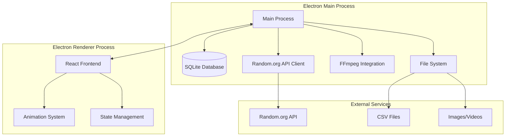

# Design Document

## Overview

The Raffle Drawing Application is a cross-platform Electron desktop application that provides a comprehensive solution for managing and conducting raffle drawings with CS2-style animations. The application features a modern React-based frontend with a Node.js backend, SQLite database for persistence, and advanced features including FFmpeg video recording, Random.org API integration, and sophisticated animation systems.

The system is designed with a modular architecture supporting multiple animation styles, bulk operations, and high-performance handling of large datasets (10,000+ participants). The application emphasizes user experience with smooth 60fps animations, intuitive admin workflows, and professional-grade recording capabilities.

## Architecture

### System Architecture



### Technology Stack

**Desktop Framework:**
- Electron.js (latest stable) for cross-platform desktop application
- Node.js backend with IPC communication

**Frontend:**
- React 18 with TypeScript for type safety
- React Router for navigation
- Framer Motion for advanced animations
- Ant Design for UI components

**Backend & Data:**
- SQLite with better-sqlite3 for high-performance database operations
- Node.js fs/promises for file operations
- csv-parser for CSV processing with streaming support

**Animation & Media:**
- Web Audio API for sound effects (optional)
- FFmpeg via fluent-ffmpeg for video recording

**External Integrations:**
- Axios for HTTP requests to Random.org API
- Sharp for image processing and optimization

## Components and Interfaces

### Core Components

#### 1. Dashboard Component
```typescript
interface DashboardProps {
  raffles: Raffle[];
  onCreateRaffle: () => void;
  onEditRaffle: (id: string) => void;
  onDeleteRaffle: (id: string) => void;
  onStartDrawing: (id: string) => void;
}

interface RaffleGridItem {
  id: string;
  name: string;
  status: RaffleStatus;
  participantCount: number;
  backgroundImage?: string;
  createdDate: Date;
  lastModified: Date;
}
```

#### 2. Raffle Configuration Component
```typescript
interface RaffleConfigProps {
  raffle?: Raffle;
  onSave: (config: RaffleConfig) => void;
  onCancel: () => void;
}

interface RaffleConfig {
  name: string;
  backgroundImage?: File;
  animationStyle: AnimationStyle;
  colorScheme: ColorScheme;
  logoPosition: LogoPosition;
  csvFile?: File;
}

type AnimationStyle = 
  | 'cs2_case' 
  | 'spinning_wheel' 
  | 'card_flip' 
  | 'slot_machine' 
  | 'particle_explosion' 
  | 'zoom_fade';
```

#### 3. Animation Engine Component
```typescript
interface AnimationEngineProps {
  participants: Participant[];
  winner: Participant;
  animationStyle: AnimationStyle;
  backgroundImage?: string;
  onAnimationComplete: () => void;
  recordingEnabled: boolean;
}

interface AnimationConfig {
  duration: number;
  easing: string;
  particleCount?: number;
  scrollSpeed: number;
  rarityColors: RarityColorMap;
}
```

#### 4. CSV Import Component
```typescript
interface CSVImportProps {
  onImportComplete: (participants: Participant[]) => void;
  onValidationError: (errors: ValidationError[]) => void;
}

interface CSVValidationResult {
  isValid: boolean;
  errors: ValidationError[];
  warnings: ValidationWarning[];
  participantCount: number;
  preview: Participant[];
}
```

### Data Models

#### Core Data Structures
```typescript
interface Raffle {
  id: string;
  name: string;
  backgroundImagePath?: string;
  csvFilePath: string; // Path to the CSV file containing participants
  status: 'draft' | 'ready' | 'completed' | 'archived';
  animationStyle: AnimationStyle;
  createdDate: Date;
  modifiedDate: Date;
  customSettings: RaffleSettings;
  participantCount: number;
}

interface Participant {
  id: string;
  raffleId: string;
  username: string;
  firstName?: string;
  lastName?: string;
  email?: string;
  phoneNumber?: string;
  profileImageUrl: string;
  ticketNumber: string;
  importDate: Date;
}

interface Drawing {
  id: string;
  raffleId: string;
  winnerId: string;
  drawTimestamp: Date;
  randomOrgVerification?: string;
  recordingFilePath?: string;
  drawSettings: DrawingSettings;
}

interface RarityLevel {
  name: string;
  color: string;
  chance: number;
}
```

### Service Interfaces

#### Database Service
```typescript
interface DatabaseService {
  // Raffle operations
  createRaffle(raffle: Omit<Raffle, 'id'>): Promise<Raffle>;
  updateRaffle(id: string, updates: Partial<Raffle>): Promise<Raffle>;
  deleteRaffle(id: string): Promise<void>;
  getRaffle(id: string): Promise<Raffle | null>;
  getAllRaffles(): Promise<Raffle[]>;
  
  // Drawing operations
  recordDrawing(drawing: Omit<Drawing, 'id'>): Promise<Drawing>;
  getDrawingHistory(): Promise<Drawing[]>;
}

interface FileService {
  // CSV file operations
  saveCSVFile(raffleId: string, csvFile: File): Promise<string>; // Returns file path
  loadParticipants(csvFilePath: string): Promise<Participant[]>;
  validateCSVFile(csvFile: File): Promise<CSVValidationResult>;
  deleteCSVFile(csvFilePath: string): Promise<void>;
}
```

#### Random Service
```typescript
interface RandomService {
  selectWinner(participants: Participant[]): Promise<{
    winner: Participant;
    verificationData?: string;
    fallbackUsed: boolean;
  }>;
  
  assignRarities(participants: Participant[]): Participant[];
}
```

#### Recording Service
```typescript
interface RecordingService {
  startRecording(options: RecordingOptions): Promise<void>;
  stopRecording(): Promise<string>; // Returns file path
  isRecording(): boolean;
}

interface RecordingOptions {
  quality: '720p' | '1080p' | '4K';
  frameRate: 30 | 60;
  codec: 'h264' | 'h265';
  outputFormat: 'mp4' | 'mov' | 'avi';
  audioEnabled: boolean;
}
```

## Data Models

### Database Schema

```sql
-- Raffles table
CREATE TABLE raffles (
    id TEXT PRIMARY KEY,
    name TEXT NOT NULL,
    background_image_path TEXT,
    csv_file_path TEXT NOT NULL, -- Path to CSV file with participants
    status TEXT DEFAULT 'draft',
    animation_style TEXT DEFAULT 'cs2_case',
    created_date DATETIME DEFAULT CURRENT_TIMESTAMP,
    modified_date DATETIME DEFAULT CURRENT_TIMESTAMP,
    custom_settings TEXT -- JSON string
);

-- Note: Participants are stored as CSV files in the application directory
-- No participants table needed in database

-- Drawings table
CREATE TABLE drawings (
    id TEXT PRIMARY KEY,
    raffle_id TEXT REFERENCES raffles(id),
    winner_id TEXT REFERENCES participants(id),
    draw_timestamp DATETIME DEFAULT CURRENT_TIMESTAMP,
    random_org_verification TEXT,
    recording_file_path TEXT,
    draw_settings TEXT -- JSON string
);

-- Settings table
CREATE TABLE settings (
    key TEXT PRIMARY KEY,
    value TEXT,
    category TEXT,
    modified_date DATETIME DEFAULT CURRENT_TIMESTAMP
);

-- Indexes for performance

CREATE INDEX idx_drawings_raffle_id ON drawings(raffle_id);
CREATE INDEX idx_raffles_status ON raffles(status);
CREATE INDEX idx_raffles_modified_date ON raffles(modified_date);
```

### File Storage Structure

The application will store CSV files in a structured directory:

```
app-data/
├── raffles/
│   ├── raffle-{id}/
│   │   ├── participants.csv
│   │   └── background.jpg (optional)
│   └── raffle-{id}/
│       ├── participants.csv
│       └── background.png (optional)
└── recordings/
    ├── raffle-{id}-{timestamp}.mp4
    └── raffle-{id}-{timestamp}.mp4
```

### CSV Data Format

The CSV files will contain participant data in this format:

```typescript
interface CSVRow {
  Username: string;
  'First Name'?: string;
  'Last Name'?: string;
  'User Email ID'?: string;
  'Phone Number'?: string;
  'Ticket Number': string;
  'User Profile': string; // Profile image URL
}
```

## Error Handling

### Error Categories

#### 1. CSV Import Errors
```typescript
interface CSVError {
  type: 'missing_column' | 'invalid_format' | 'duplicate_ticket' | 'invalid_url';
  row: number;
  column: string;
  message: string;
  severity: 'error' | 'warning';
}
```

#### 2. API Errors
```typescript
interface APIError {
  type: 'network' | 'rate_limit' | 'invalid_response' | 'service_unavailable';
  message: string;
  fallbackUsed: boolean;
  retryAfter?: number;
}
```

#### 3. Database Errors
```typescript
interface DatabaseError {
  type: 'connection' | 'constraint' | 'disk_space' | 'corruption';
  operation: string;
  message: string;
  recoverable: boolean;
}
```

### Error Recovery Strategies

1. **Random.org API Failures**: Automatic fallback to crypto.randomBytes()
2. **Database Corruption**: Automatic backup restoration
3. **File System Errors**: Graceful degradation with user notification
4. **Memory Issues**: Streaming for large datasets
5. **Recording Failures**: Continue drawing without recording

## Testing Strategy

### Unit Testing
- **Database Operations**: Test all CRUD operations with mock data
- **CSV Parsing**: Test various CSV formats and edge cases
- **Random Selection**: Test distribution and verification
- **Animation Logic**: Test timing and state transitions

### Integration Testing
- **Electron IPC**: Test main-renderer communication
- **File Operations**: Test CSV import/export workflows
- **API Integration**: Test Random.org API with mocked responses
- **Database Migrations**: Test schema updates

### Performance Testing
- **Large Dataset Handling**: Test with 10,000+ participants
- **Animation Performance**: Measure FPS during animations
- **Memory Usage**: Monitor memory consumption during operations
- **Database Performance**: Test query performance with large datasets

### End-to-End Testing
- **Complete Raffle Workflow**: From creation to drawing completion
- **Multi-Raffle Management**: Test bulk operations
- **Recording Integration**: Test video recording during animations
- **Cross-Platform**: Test on Windows, macOS, and Linux

### Test Data
```typescript
const mockParticipants = generateMockParticipants(1000);
const mockRaffles = generateMockRaffles(50);
const mockCSVData = generateMockCSV(5000);
```

### Animation Performance Optimization

#### Hardware Acceleration
- Use Canvas with GPU acceleration
- Implement object pooling for particle systems
- Optimize image loading and caching
- Use requestAnimationFrame for smooth animations

#### Memory Management
- Lazy loading of participant images
- Image compression and resizing
- Garbage collection optimization
- Streaming for large participant lists

#### Rendering Pipeline
```typescript
interface RenderPipeline {
  preloadAssets(): Promise<void>;
  initializeCanvas(): void;
  startAnimationLoop(): void;
  renderFrame(timestamp: number): void;
  cleanup(): void;
}
```


## Deployment Strategy

### Build Process
- **Cross-Platform Builds**: Use electron-builder for Windows (.exe), macOS (.dmg), and Linux (.deb/.rpm)
- **Code Signing**: Sign applications for all platforms to avoid security warnings
- **Asset Optimization**: Compress and optimize all static assets during build
- **Dependency Management**: Bundle only required dependencies to minimize package size

### Distribution
- **Auto-Updater**: Implement electron-updater for seamless application updates
- **Release Channels**: Support stable, beta, and alpha release channels
- **Rollback Capability**: Ability to rollback to previous versions if issues occur
- **Platform-Specific**: Native installers with proper system integration

### Installation Requirements
- **System Dependencies**: FFmpeg bundled or auto-installed based on platform
- **Database Migration**: Automatic database schema migration on version updates
- **Settings Migration**: Preserve user settings and data across updates
- **Cleanup**: Proper uninstallation with optional data retention

This design provides a solid foundation for implementing the raffle drawing application with all the specified features while maintaining performance, scalability, user experience, and deployment standards.